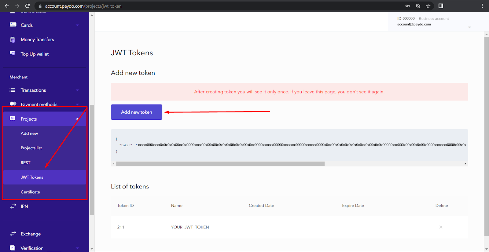

* [Back to contents](../Readme.md#contents)

# Bearer authentication

Some requests to PayDo API require authentication.

PayDo API Authentication is based on JWT tokens and uses [Bearer Authentication](https://swagger.io/docs/specification/authentication/bearer-authentication/). The client must send this token in the `Authorization` header when making requests to protected resources:


```
Content-Type: application/json
Authorization: Bearer YOUR_JWT_TOKEN
```


---
**Note:** <em>Authentication using a <code>token</code> header is deprecated. This functionality may be removed in the next major API version.</em>

---


## Get an authentication token

You can create and view your API keys in your account, using the Add new token button. You will have to enter the token “Name” and you may be required to enter your 2FA code if two-factor authentication has been set beforehand.





---

**Note:** After creating a token you will see it **only once**, right after creating the token. However, you can create as many tokens as you need.


---

After the token **deletion**, you can't authenticate with this token anymore.

You can set the token **expiration date**. After this date, you can't authenticate using this token anymore. If the expiration date is not set, the token can be used until it is deleted.


## [→ API Response examples - Success response example](../Response/successResponse.md)
