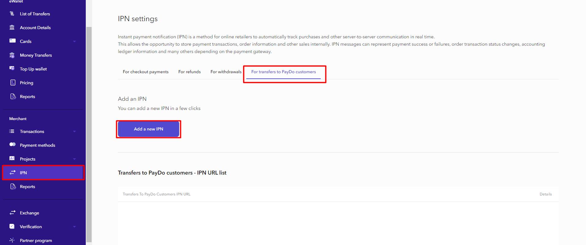

* [Back to contents](../Readme.md#contents)

# IPN For transfers to PayDo customers

This is a functionality for receiving notifications about transfers of funds to users within the PayDo system. The functionality is only available to business users. Notifications sends only when transferring funds to another user. When receiving funds - notifications don't sends.

Notification sends only when the transaction status is “Accepted” or “Rejected”

IPN For transfers to PayDo customers can be only one per user


---

## For instance:

 **CASE 1.** You received several IPNs with the same data and the `success` state for the order ID 1111;

 **CASE 2.** You received an IPN for the order ID 1111 with the `failed` status; later on, you received another IPN notification with the same transaction data for the order ID 1111 but with the `success` state.

## Solution:

 **CASE 1.** You only need to accept the first notification and ignore the others;

 **CASE 2.** You shouldn't ignore notifications with a different state to let the transaction status become updated.


---

**Note:** A notification is sent to the merchant's server within 24 hours and until the PayDo server, upon this request, receives the HTTP status code "200 OK".

---

**For greater security, we highly recommend that you accept IPN only from our IP addresses:**

```
52.49.204.201
54.229.170.212
```
---
## Create IPN by user
In order to add a URL for getting callbacks on Transactions Between Customers you can contact our support team or you can do it by yourself.
To do this you need to follow the instructions below.

**Steps 1:** Login in business account

**Steps 1:** Click the “IPN” sidebar tab

**Steps 1:** Select the “For transfers to PayDo customers” tab

**Steps 1:** Click the “Add a new IPN” button

**Steps 1:** Paste your URL on wich you will get callbacks

**Steps 1:** Click the “Create IPN” button




---
## IPN Request example


```
POST https://url from your project
```


```
Content-Type: application/json
```

```json
{
  "transaction": {
    "amount": 25,
    "status": 3,
    "currency": "EUR",
    "identifierTxFrom": "aa937aa8-1234-567a-b759-45a956359d28"
  }
}
```

---


| Parameter                |Type| Description                                          |
|--------------------------|--- |------------------------------------------------------|
| amount                   |string| Amount of funds transferred to the payer             |
| identifierTxFrom        |string| Transfers identifier                               |
| status     |number| Transaction state  <br/>2 - Accepted<br/>3 - Rejected|


## [→ Refund - Create refund](../Refund/createRefund.md)
