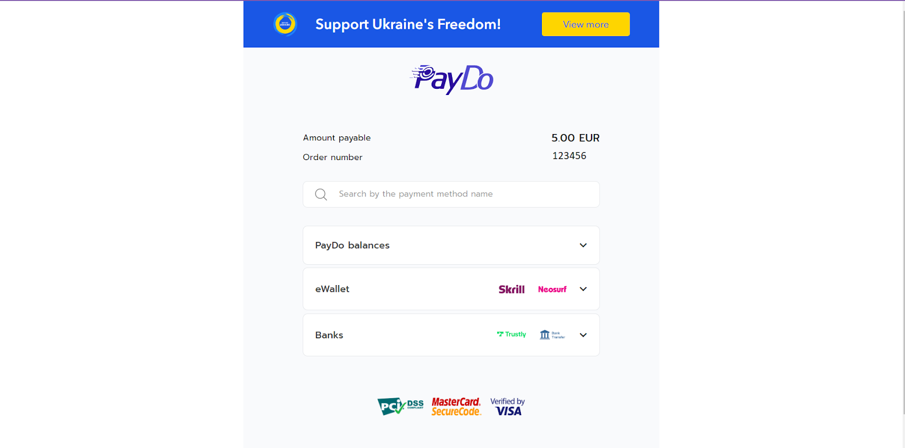
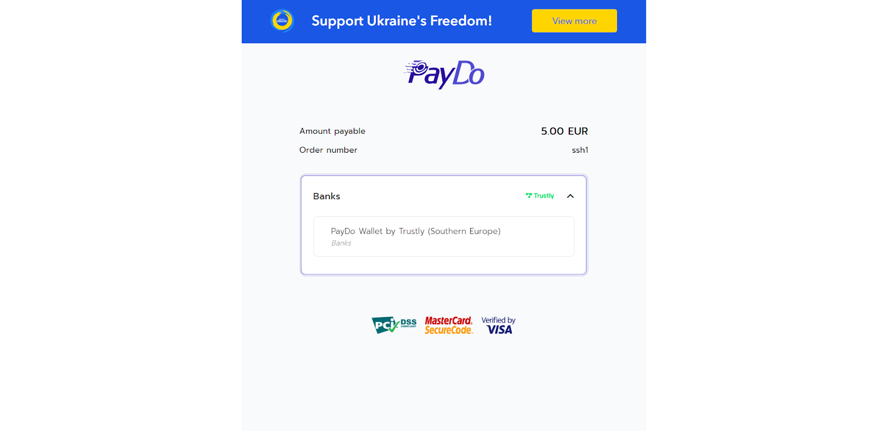

* [Back to contents](../Readme.md#paydo-integration-options)

# **Integration API types:**

## [1. Hosted Page](../Integration/hostedPage.md)

This type of integration is available to everyone by default, this is the most preferable and easiest way. The checkout page is currently available in English.

The methods on the page in the upper block are displayed following the localization set in the browser being used. And for this country, payment methods are selected that are available for the country and available to the merchant.

Methods are displayed following the payer's IP in the lower block.

Features of this type of integration:

* _no need to create your own checkout page, or a data entry form for card methods_
* _you don’t need to implement data processing for redirecting to the 3DS page - you can customize the standard checkout page_
* _no need to obtain a special certificate to be able to make payments (PCI DSS LVL 1 or 2 (AOC form) compliance)_
* _it will not be possible to immediately transfer the payer's card data for card methods in order to minimize the payment path_
* _checkout occurs on the PayDo page (there is a redirect from your domain name to paydo.com)_

## [2. Direct integration](../Integration/directIntegration.md)

This type integration is more suitable for businesses experienced in development.

Using this type of integration it is possible to skip the initial PayDo checkout page and integrate each method independently by passing the Method ID in the request. This will redirect the payer directly to the payment data entry page for a specificified method. Therefore, by using this integration type, you can use several payment methods on your own checkout page and redirect payer directly to the page for entering the payment data.

Features of this type of integration:

* _you can create your own checkout page and customize it according to your needs_
* _no need to obtain a special certificate to be able to make payments (PCI DSS LVL 1 or 2 (AOC form) compliance)_
* _you can minimize the amount of actions needed to be done by client in order to complete the payment_
* _you will need to use more requests when making payments (as compared with hosted page)_

