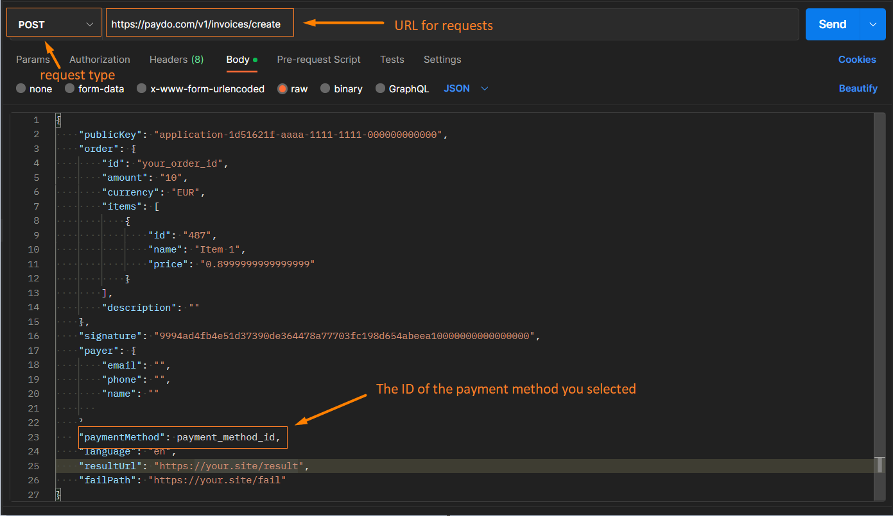

* [Back to contents](../Readme.md#paydo-integration-options)

# **Direct integration (Hosted page)**

Direct integration is a type of hosted page integration that bypasses the PayDo [hosted page.](../Integration/hostedPage.md) Workflow is the same as Hosted Page, except when you make an invoice you need to add in your request the required field: ''Payment methods'' with a specific number.

To create such an invoice you need to enter the ID of the payment method you need in the "paymentMethod" field

You can see all available payment method identifiers for your project with this query: [Get available payment methods](../Methods/getAvailablePaymentMethods.md)