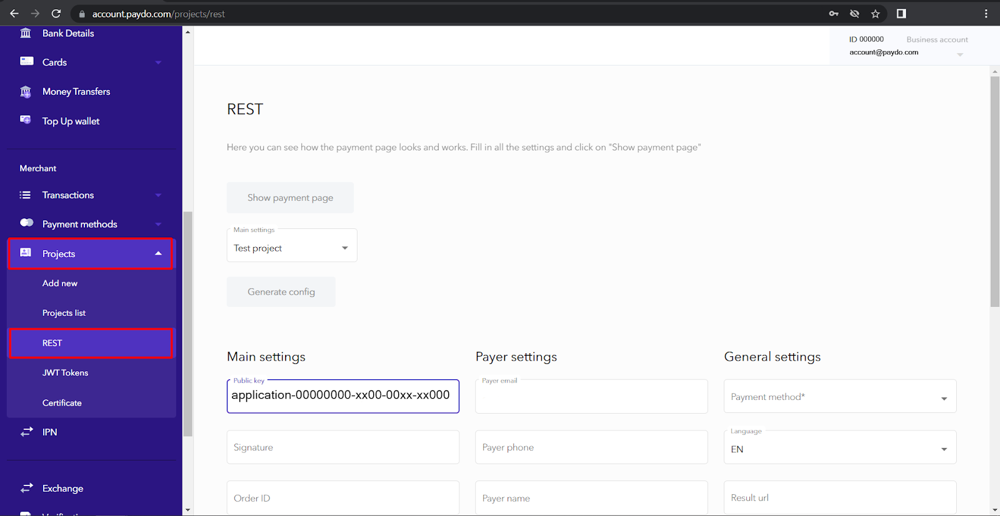
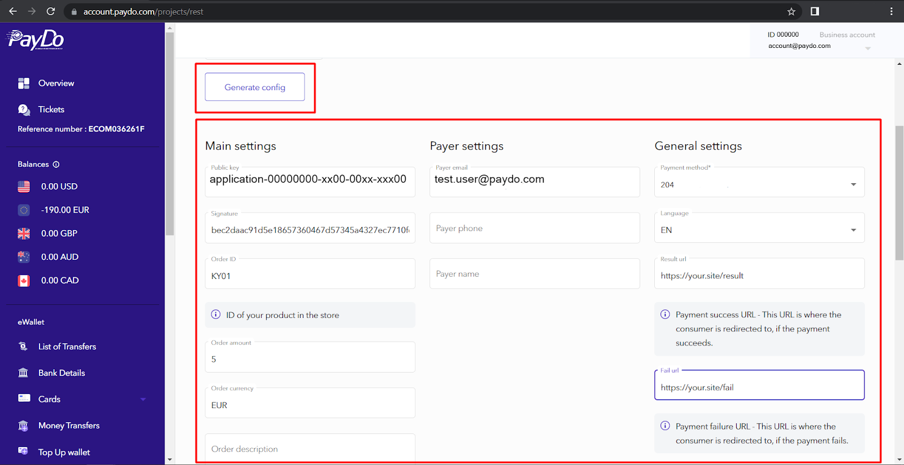
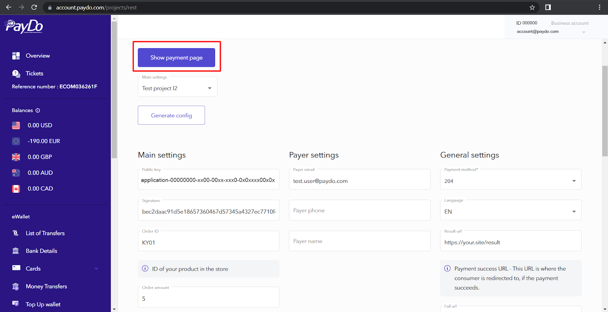
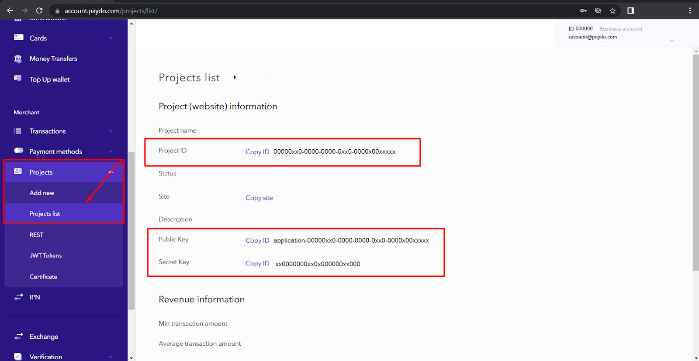

* [Back to contents](../Readme.md#contents)

# Create invoice

* [Endpoint description](#endpoint-description)
* [Payer](#payer)
* [Template expressions](#template-expressions)
* [Signature](#signature)
* [Request example](#request-example)
* [Successful response example](#successful-response-example)
* [Error response examples](#error-response-examples)

---
**Invoice** - is a basic entity in each payment and when you start payment, you pay the invoice. Checkout transactions can be created only for invoices. It can be useful for you to get [merchant payment methods](../Checkout/getAvailablePaymentMethods.md) first.

You can create an example request in the personal merchant's account in the section Projects > REST.





You must fill in the order data into the respective fields to generate a page:


Click on the “Show payment page” button to view the Checkout Page:



 ---

  Please note that you can either create an invoice that will redirect the payer to the checkout page with all the payments available to them (for your project and the payer’s IP address and/or browser locale), or an invoice redirecting the payer to a specific payment method of your choice.
 
 ---

For this, make use of the `paymentMethod` field of your request:

If you choose to leave it empty, a full list of payment methods available for your payer will be displayed. Otherwise, fill in the needed `payment method ID` to have the payer proceed to use it directly. You can refer to a request example in [this section](../Invoice/createInvoice.md#request-example).


## Endpoint description


```
POST https://paydo.com/v1/invoices/create
```


```
Content-Type: application/json
```


**Parameters**


|Parameter|Type|Description|Required|
|--- |--- |--- |--- |
|publicKey&nbsp;&nbsp;&nbsp;&nbsp;&nbsp;&nbsp;&nbsp;&nbsp;&nbsp;&nbsp;&nbsp;&nbsp;&nbsp;&nbsp;&nbsp;&nbsp;&nbsp;&nbsp;&nbsp;&nbsp;&nbsp;&nbsp;&nbsp;&nbsp;&nbsp;&nbsp;&nbsp;&nbsp;&nbsp;&nbsp;&nbsp;&nbsp;&nbsp;&nbsp;&nbsp;&nbsp;&nbsp;&nbsp;&nbsp;&nbsp;|string|Public key issued in the project.|*|
|**order**|**JSON object**|Order info|*|
|&emsp;order.id|string|Payment ID|*|
|&emsp;order.amount|string|Amount of the payment|*|
|&emsp;order.currency|string|The character code of the payment currency, which is supported by the selected payment method.|*|
|&emsp;order.description|string|Description of payment|*|
|&emsp;order.items|json array|Products or services included in the order. An array containing arbitrary data. Can be an empty array.|*|
|**payer**|**JSON object**|[Payer](#payer) info|*|
|&emsp;payer.email|string|Payer email||
|&emsp;payer.name|string|Payer name||
|&emsp;payer.phone|string|Payer phone||
|&emsp;payer.extraFields|JSON object|payer extra info (fieldName:fieldValue)||
|language|string|Language (en, ru).|*|
|resultUrl|string|Successful payment link. Allowed to use [template expression](#template-expressions).|*|
|failPath|string|Unsuccessful payment link. Allowed to use [template expression](#template-expressions).|*|
|productUrl|string|Used to redirect your payers back to your website\product page from the checkout page. (the "←" icon, on the checkout page)||
|signature|string|[Signature](#signature)|*|
|paymentMethod|string|Payment method_id selected for this invoice. One of [available payment methods](../Methods/getAvailablePaymentMethods.md)||
|metadata|JSON object|Arbitrary structure object to store any additional merchant data. Result JSON should be less than 800 kB||


---

**Note:** You can get the Public and Secret Key in the merchant admin panel in the Projects -> Projects List -> Details section. 

The public key looks like this: **application-7cccbe4b-e448-49d3-96d0-35f1a35dg89e**

---





## Payer


###### 
The structure of the payer data is  a specific set of fields such as `email`, `name`, `phone`, `extraFields`. Field `email` required. Other fields depend on the selected payment method.

It's not necessary to fill these fields at this stage, because you can provide the payer’s data when creating transactions. But if you save payer data with an invoice, later this data will be merged into a transaction.


---

**Note:** To avoid rigid binding to the structure, which does not give the entire possible list of fields to save all possible data, you can use "extraFields" field to save payer “extraFields”.


---

Payer object example:


```json
{
    "email": "PAYER_EMAIL@EMAIL.COM",
    "extraFields": {
        "nationalid": "GB-123456798",
        "name": "PAYER_NAME"
    }   
}
```


## Template expressions

Template expressions are useful when you need to make some replacements in the strings. Currently, only the below parameters support template expressions.


|Parameter|Patterns|
|--- |--- |
|resultUrl|{{invoiceId}}, {{txid}}|
|failPath|{{invoiceId}}, {{txid}}|


|Pattern|Replacement|
|--- |--- |
|{{invoiceId}}|Replaced with PayDo invoice id|
|{{txid}}|Replaced with PayDo transaction id|


Examples:


```
    # Template
    https://your.site/result-page/?invoiceId={{invoiceId}}&txid={{txid}}


    # Result
    https://your.site/result-page/?invoiceId=b8bf37ab-fc69-44df-bfeb-b9a879ce20b7&txid=1eeda2f2-d3e1-4edd-853e-3d897bc629b2

    # Template
    https://your.site/result-page/{{txid}}/


    # Result
    https://your.site/result-page/1eeda2f2-d3e1-4edd-853e-3d897bc629b2/
```


## Signature

A digital signature of the payment is necessary in order to check the immutability/correctness of the data in the process of transferring them over the network between the participants of the payment.

A signature is required only on invoice creation.

A signature encryption method is SHA-256

The parameters that make up the digital signature (the order of the parameters does matter, the parameters must be identical to the parameters in your API request.)

## Parameters


|Parameter|Description|Type|Example|
|--- |--- |--- |--- |
|order[id]|Payment ID.Should be identical to order.id in your request.|string|FF01; 354|
|order[amount]|Amount of payment.Should be identical to order.amount in your request. (It does matter how you specify this parameter, 5 and 5.00 are two different entry types and may affect the correctness of the signature)|string|100.0000|
|order[currency]|Character code of payment currency, which is supported by the selected payment method. Should be identical to order.currency in your request.|string|USD; EUR|
|secretKey|Project secret key from the merchant admin panel in the Projects -> Projects List -> Details section.|string|rekrj1f8xxxwerwer|


#### 
Signature is generated by making an SHA-256 hash of such a string as: "order.amount:order.currency:order.id:secretKey" (values separated by ":", ordering and case matters).


#### 
**Signature generation example (PHP)**


```php
<?php
    $order = ['id' => 'FF01', 'amount' => '100.0000', 'currency' => 'USD'];
    ksort($order, SORT_STRING);
    $dataSet = array_values($order);
    $dataSet[] = '$secretKey';
    hash('sha256', implode(':', $dataSet));
?>
```


#### 
**Examples of signatures generated from real data**


```
Amount: "1.2000"
Currency: "USD"
Order ID: "Test-Order-354"
Secret key: "secretkey"
Result : 3445000c1f55f447b853fe068529c23fc4188e36aa4984e37836538d95f8e015

Amount: "0.4500"
Currency: "EUR"
Order ID: "FK-288-SDC"
Secret key: "another_secretkey"
Result: 15c4c6ee83285dd82e1d7d29984a718cc527f218b8a0bb7e9b951b08ea1f30cd
```


## Request example


```php
curl -X POST \
  https://paydo.com/v1/invoices/create \
  -H 'Content-Type: application/json' \
  -d '{
    "publicKey": "YOUR_PUBLIC_KEY",
    "order": {
        "id": "12345",
        "amount": "3",
        "currency": "EUR",
        "items": [
            {
                "id": "487",
                "name": "Item 1",
                "price": "0.8999999999999999"
            },
            {
                "id": "358",
                "name": "Item 2",
                "price": "2.0999999999999996"
            }
        ],
        "description": ""
    },
    "signature": "1ab0dec9b3e6458c5ec76041e5299",
    "payer": {
        "email": "test.user@paydo.com",
        "phone": "",
        "name": "PAYER_NAME",
        "extraFields": ""
    },
    "paymentMethod": 204,
    "language": "en",
    "resultUrl": "https://your.site/result",
    "failPath":  "https://your.site/fail",
    "productUrl": "https://your.site/redirect"
    "metadata":[{
                "TestData": "487",
                "ProductName": "Item 1",
                "ProductId": "547689"
            }]
 }'
```
---


## Successful response example

In case of a successful response you can get a invoice identifier from the body `"data"`


```
HTTP/1.1 200 OK
```

```
Content-Type: application/json
Authorization: Bearer YOUR_JWT_TOKEN
```


```json
{
    "data": "81962ed0-a65c-4d1a-851b-b3dbf9750399",
    "status": 1
}
```

---

## Error response examples


```
HTTP/1.1 404 Not Found
```


```
Content-Type: application/json
```


```json
{
   "message": "Application not found"
}
```


```
HTTP/1.1 422 Unprocessable Entity
```

```
Content-Type: application/json
```


```json
{
    "message": {
        "publicKey": ["This value should not be blank."]
    }
}
```


In case of incorrect signature generation, you will receive the following response:


```
{
  "message": "Wrong signature"
}
```
---


## [→ Get invoice info](../Invoice/getInvoice.md)
