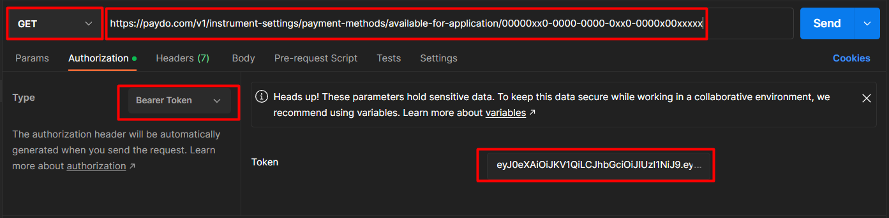
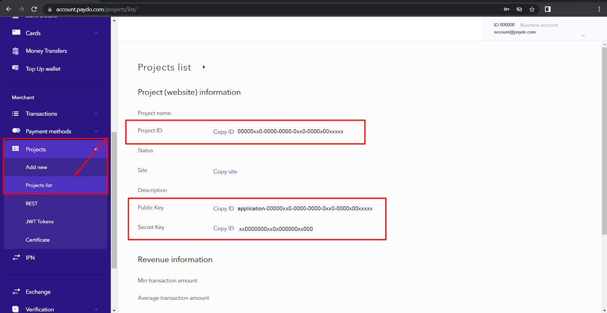

* [Back to contents](../Readme.md#contents)

# Get available payment methods


* [Instruction](#instruction)
* [Endpoint description](#endpoint-description)
* [Request example](#request-example)
* [Successful response example](#successful-response-example)
* [Required fields description](#required-fields-description)

## Instruction


Please be advised that there is a wide range of API testing tools (e.x. Postman, REST-assured, JMeter, Curl, etc.) to make API requests and receive information, you need to choose the most convenient for you.

In the following section, the Postman API platform will be used in order to describe how to receive information regarding payment methods available for your project.


* Please create a new GET request using the endpoint described below in the Endpoint Description, your application \ project identifier, and your [JWT token](../Authentication/authentication.md).



* Use the correct Key\Value pair in the Headers section. (Also described in the Headers section of the Endpoint description)


* If everything is done correctly, you should receive a correct response with 200 OK status, showing the available payment methods and all the details required for the payment method integration process.

**Note:** You can get the Application \ Project identifier as well as the Public and Secret Key in the merchant admin panel in the Projects -> Projects List -> Details section.


---





## Endpoint description

**Important!** This endpoint requires [authentication](../Authentication/authentication.md).

Get payment methods list available for merchant per application/project.

Please note, when creating an invoice you can only use payment methods available for your application.


```
GET https://paydo.com/v1/instrument-settings/payment-methods/available-for-application/{id}
```


```
Content-Type: application/json
Authorization: Bearer YOUR_JWT_TOKEN
```


|Parameter|Type|Description|Required|
|--- |--- |--- |--- |
|id|string|Application/Project identifier|*|


## Request example


```
curl -X GET \
  https://paydo.com/v1/instrument-settings/payment-methods/available-for-application/YOUR_PROJECT_ID \
    -H 'Content-Type: application/json' \
    -H 'Authorization: Bearer YOUR_JWT_TOKEN'
```


## Successful response example


```
HTTP/1.1 200 OK
```

```
Content-Type: application/json
Authorization: Bearer YOUR_JWT_TOKEN
```


```json
{
  "data": [
  {
            "identifier": 204,
            "title": "PaydoEWallet",
            "logo": "https://di041rkff4jt3.cloudfront.net/images/methods/paydoEWallet.jpg",
         
            "currencies": [
                "EUR"
            ],
            "countries": [
                "DE",
                "IL"
            ],
            "config": {
                "fields": [
                    {
                        "name": "email",
                        "type": "email",
                        "required": true
                    },
                    {
                        "name": "name",
                        "type": "text",
                        "required": true
                    }
                ]
            },
 
        }
    ],
    "status": 1
}
```


## Error response examples

In case of incorrect or outdated JWT token, you will receive the following response:


```
HTTP/1.1 401 Unauthorized
Content-Type: application/json
```


```json
{
  "message": "Authorization token invalid"
},
```


In case of edited or incorrect JWT token you will receive the following errors:


```
HTTP/1.1 422 Unprocessible entity
Content-Type: application/json
```


```json
{
"message": "Syntax error, malformed JSON",
 "status": 0
}
```


```
HTTP/1.1 422 Unprocessible entity
Content-Type: application/json
```


```json
{
"message": "Malformed UTF-8 characters", 
"status": 0 
}
```


```
HTTP/1.1 422 Unprocessible entity
Content-Type: application/json
```


```json
{
"message": "Unexpected control character found", 
"status": 0
}
```


## Required fields description

As you can see, the `config.fields` section of the response contains a description of the required fields. For direct payment ( payment without an intermediate checkout form) using this payment method, you must fill out all the required fields when [creating invoice](../Invoice/createInvoice.md). Otherwise, during the payment process, the payer will be redirected to the checkout form, where he/she will have to manually fill in the required fields.


---

Note: Please note the way in which the fields are filled in: fields `email`, `phone`, `name` are contained in the `payer` object, and all other necessary fields are contained in a nested `extraFields` object. Example:


```json
{
 "payer": {
   "email": "PAYER_EMAIL@EMAIL.COM",
   "phone": "PAYER_PHONE",
   "name": "PAYER_NAME",
   "extraFields": {
     "nationalid": "GB-123456798",
     "other": "SOME_DATA"
   }
 }
}
```


## [→ Authentication - Bearer authentication](../Authentication/authentication.md)
