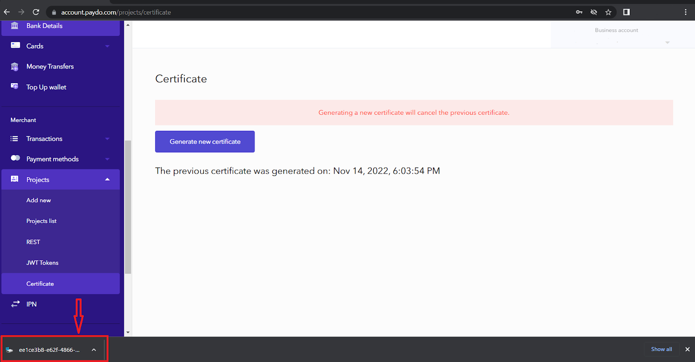
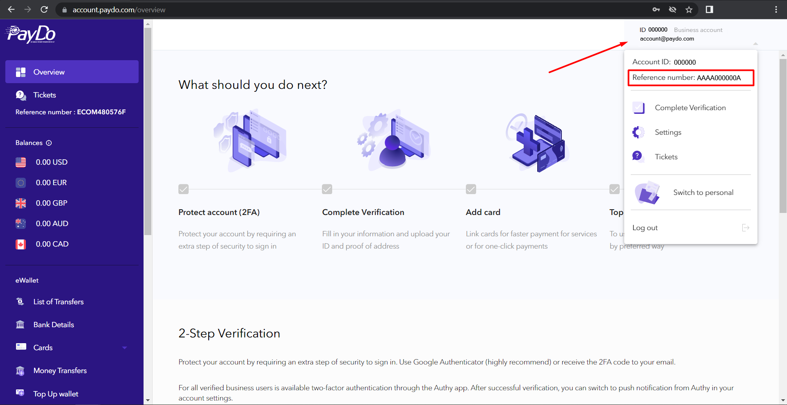

* [Back to contents](../Readme.md#contents)

# Transfer Between Wallets

* [Request payload encrypt](https://github.com/PaydoW/paydo-api-doc/blob/master/Wallet/moveMoneyBetweenWalletsWithdrawal.md#request-payload-encryptdecrypt)
* [Endpoint description](#endpoint-description)
* [Request example](#request-example)
* [Successful response example](#successful-response-example)

**Important!**  To create a transfer between wallets request, you need to create a certificate and to [encrypt request payload](#request-payload-encryptdecrypt).
You can generate and **download** your personal certificate in [your account](https://account.paydo.com/projects/certificate).





## Request payload encrypt/decrypt


While creating a request for transfer between wallets, you need to encrypt the request payload with a personal certificate.
We are using a popular encryption library to decrypt the request payload - [Sodium](https://libsodium.gitbook.io/doc/).
In short, before sending a withdrawal request you have to take the next steps:


* Encrypt request payload with [Sodium Sealed boxes](https://libsodium.gitbook.io/doc/public-key_cryptography/sealed_boxes#usage)
  (
  [Python](https://libnacl.readthedocs.io/en/latest/topics/raw_sealed.html),
  [PHP](https://www.php.net/manual/en/function.sodium-crypto-box-seal.php)
  ).
* Encode encrypted binary string with Base64.

Below you can see a PHP example, of how to encrypt request payload before sending a transfer between wallets request:

```php
// Original certificate file that was downloaded from the site (paydo.com). It contains a binary string.
$certFilePath = '/project/x25519.pub';
// Certificate must be encoded as base64 string.
// You can use below example to encode it or use linux console command: cat /project/x25519.pub | base64 
$publicKeyCertificate = base64_encode(file_get_contents($certFilePath));
// Payload
$data = [
    'recipient' => {{recipient_id}},
    'amount' => 34,
    'currency' => 'USD',
    'startCurrency' => 'USD',
    'insuranceCurrency' => 'EUR',
    'paymentMethodIdentifier' => 204,
    'accountType' => 1,
];

$encryptedPayload = sodium_crypto_box_seal(json_encode($data), base64_decode($publicKeyCertificate));
// $encryptedPayload - it's a binary string
$base64Payload = base64_encode($encryptedPayload);
// $base64Payload - looks like 9kQ7v9nXLHjeOyIqi+hIJfEKuOCQZ2C5WWVcnmfPHUxh1EbK5g=
```
See more examples [here](../Examples/apiCertificates) on how to encrypt.

>*Instead of {{recipient_id}} you can enter the user ID of the recipient. To test Transfer Between Wallets we recommend creating PayDo test account and use it as a recipient.

**Request body**

Parameter              | Type  | Required | Description
-----------------------|-------|----------|-----------------------
recipient              |string |    *     | Recipient identifier or email.
amount                 |string |    *     | Amount of money.
currency               |string |    *     | Desired currency for transfer. This currency will be received by the recipient.
startCurrency          |string |    *     | The currency of the initiator of the transfer to be converted into the desired currency.
insuranceCurrency      |string |          | Currency from which funds will be charged in case there is not enough starting currency
paymentMethodIdentifier|int    |    *     | Payment method ID is always 204 at this moment. But in the future we are going to add more methods.
accountType            |int    |          | Recipient account type. Specify only when using email as a value of the `referenceId`. [personal - 1, business 2]

The explanation:
1. The sender wishes to transfer 100 euros. He has $ 150 in his wallet. The `startСurrency` means that during the operation, 100 euros in dollar equivalent will be withdrawn from his dollar account.
2. The sender wishes to transfer 100 euros. He has $ 100 and £ 50 in his wallet. First, the required amount of euros in dollar equivalent will be withdrawn from the sender (`startСurrency`). And if there are not enough funds in the starting currency, the rest will be withdrawn from the insurance currency (`insuranceСurrency`).


To get the PayDo `referenceId` you should click on the top right corner where your email/account ID is.




## Endpoint description

**Important!** This endpoint requires [authentication](../Authentication/authentication.md).

**Endpoint**:

    POST https://paydo.com//v1/wallets/move-money-between-wallets/withdraw

**Headers**:

    Content-Type: application/json
    Authorization: Bearer YOUR_JWT_TOKEN

__For more detailed information about the request visit our OpenApi [specification](https://paydo.com/en/open-api-specification/#/Wallet)__.

## Request example:

```shell script
curl -X POST \
  https://paydo.com//v1/wallets/move-money-between-wallets/withdraw \
    -H 'Content-Type: application/json' \
    -H 'Authorization: Bearer YOUR_JWT_TOKEN' \
    -d '{
          "data": "DAqj3EwQXPNFX87HA1UJ4wiKsN2PBH2558FvLNYdyzyPTm9dou6RWXNtxnY+6HxwPIuUuqbZccC0+plKb++rVPwTNJuzT+9U6c56HpN5IJEsB+/ierqzUJdJ0FAEcohlqFuDvgXyl+vBpScR60S5HImx5rwHV8gdcdQa9CBq/KJzwNcwy96jZ33Y8ZnnZFtyHc2e92s6iC90iQo1EhVmwsW16oLobsuqiX0D7qI="
        }'
```    

## Successful response example:
Response Headers
```
HTTP/1.1 200 OK
Content-Type: application/json
identifierTxFrom: 173685f6-d0d7-54b6-a79c-2c272b5d72b7
identifierTxTo: bbbf19ff-eaad-4ccf-aa8c-c69d60aaceb0
```

**Headers**

Header             | Description
-------------------|-----------------------
identifierTxFrom   | Transaction ID of the transfer from the sender's account.
identifierTxTo     | Transaction ID of the transfer to the receiver's account.

Response Body
```json
{
    "data": [],
    "status": 1
}
```
