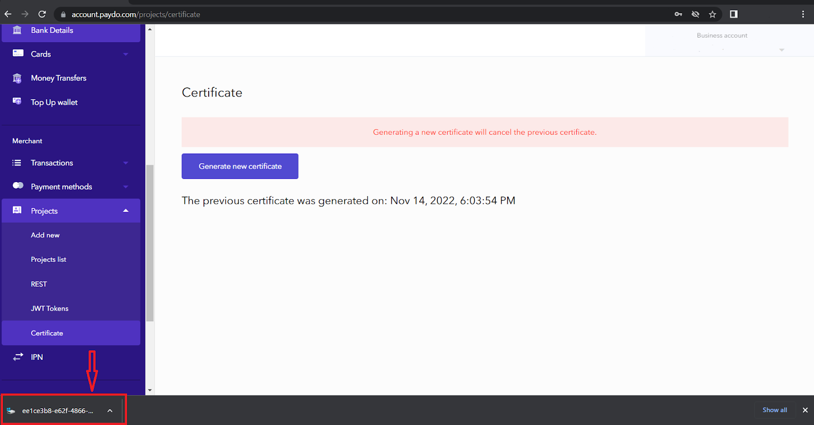
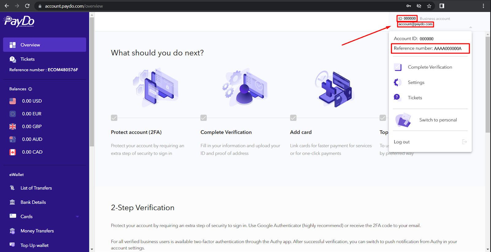

* [Back to contents](../Readme.md#contents)

# Transfer Between Wallets


* [Request payload encryption](#request-payload-encryption)
* [Endpoint description](#endpoint-description)
* [Request example](#request-example)
* [Successful response example](#successful-response-example)

>**Important!** To create a transfer between wallets request, you need to create a certificate and [encrypt the request payload](#request-payload-encryptdecrypt). You can generate and download your personal certificate to [your account](https://account.paydo.com/projects/certificate). When you generate the certificate, you receive the 2 Factor Authentication code on your registered email/application. This 6-digit verification code should be entered in the required field to create a token.





## Request payload encryption

While creating a request for transfer between wallets, you need to encrypt the request payload with a personal certificate. We are using a popular encryption library to decrypt the request payload - [Sodium](https://libsodium.gitbook.io/doc/). Before sending a withdrawal request you have to take the next steps:


* Encrypt request payload with [Sodium Sealed boxes](https://libsodium.gitbook.io/doc/public-key_cryptography/sealed_boxes#usage) ( [Python](https://libnacl.readthedocs.io/en/latest/topics/raw_sealed.html), [PHP](https://www.php.net/manual/en/function.sodium-crypto-box-seal.php) ).
* Encode encrypted binary string with Base64.

Below you can see a PHP example, of how to encrypt request payload before sending a transfer between wallets request:


```php
// Original certificate file that was downloaded from the site (paydo.com). It contains an encoded as base64 string.
$certFilePath = '/project/3924272b-9999-4f5c-8d8d-302716356f10';

$publicKeyCertificate = base64_encode(file_get_contents($certFilePath));
// Payload
$data = [
    'recipient' => {{recipient_id}},
    'amount' => 34,
    'currency' => 'USD',
    'startCurrency' => 'USD',
    'insuranceCurrency' => 'EUR',
    'accountType' => 1,
    'metadata' => ['orderId' => 'b6b5afe9-a174-4eec-9e0b-c40f58112324'],
];

$encryptedPayload = sodium_crypto_box_seal(json_encode($data), base64_decode($publicKeyCertificate));
// $encryptedPayload - it's a binary string
$base64Payload = base64_encode($encryptedPayload);
// $base64Payload - looks like 9kQ7v9nXLHjeOyIqi+hIJfEKuOCQZ2C5WWVcnmfPHUxh1EbK5g=
```


See more examples [here](../Examples/apiCertificates) on how to encrypt.

**Instead of {{recipient_id}}** you should use the account ID, e-mail, or reference number of the recipient. To test Transfer Between Wallets we recommend creating a PayDo test account and use it as a recipient. The PayDo account IDs can be found in the upper right corner of PayDo account.





**Request body**


|Parameter|Type|Required| Description                                                                                                     |
|--- |--- |--- |-----------------------------------------------------------------------------------------------------------------|
|recipient|string|*| Recipient identifier (account ID),e-mail or reference number                                                    |
|amount|string|*| Amount of funds.                                                                                                |
|currency|string|*| Desired currency for transfer. This currency will be received by the recipient.                                 |
|startCurrency|string|*| The currency of the initiator of the transfer to be converted into the desired currency.                        |
|insuranceCurrency|string|| Currency from which funds will be charged in case there is not enough starting currency                         |
|accountType|int|| Recipient account type. Specify only when using email as a value of the referenceId. [personal - 1, business 2] |
|metadata|JSON object|| Arbitrary structure object to store any additional merchant data. Result JSON should be less than 2kB       |


**The explanation:**


1. The sender wishes to transfer 100 euros. He has $ 150 in his wallet. The `startСurrency` means that during the operation, 100 euros in dollar equivalent will be withdrawn from his dollar account.
2. The sender wishes to transfer 100 euros. He has $ 100 and £ 50 in his wallet. First, the required amount of euros in dollar equivalent will be withdrawn from the sender (`startСurrency`). And if there are not enough funds in the starting currency, the rest will be withdrawn from the insurance currency (`insuranceСurrency`).

## Endpoint description


>**Important!** This endpoint requires [authentication](../Authentication/authentication.md).


```
POST https://paydo.com/v1/wallets/move-money-between-wallets/withdraw
```


```
Content-Type: application/json
Authorization: Bearer YOUR_JWT_TOKEN
idempotency-key: UUID
```

**idempotency-key** - Unique value generated by the user which the API uses to recognize subsequent retries of the same request. In case of sent request with same key more than once,
all secondary request will be processed with response code **409 Conflict**.

For more detailed information about the request visit our OpenApi [specification](https://paydo.com/en/open-api-specification/#/Wallet).


## Request example


```php
curl -X POST \
  https://paydo.com/v1/wallets/move-money-between-wallets/withdraw \
    -H 'Content-Type: application/json' \
    -H 'Authorization: Bearer YOUR_JWT_TOKEN' \
    -d '{
          "data": "DAqj3EwQXPNFX87HA1UJ4wiKsN2PBP2558FvLNYdyzyPTm9dou6RWXNtxnY+6HxwPIuUuqbZccC0+plKb++rVPwTNJuzT+9U6c56HpN5IEEsB+/ierqzUJdJ0FAEcohlqFuDvgXyl+vBpScR60S5HImx5rwHV8gdcdQa9CBq/KJzwNcwy96jZ33Y8ZnnZFtyHc2e92s6iC90iQo1EhVmwsW16oLobsuqiX0D7qI="
        }'
```


## Transfers to PayDo customers

The method described above can be used to make payouts to your customers' PayDo wallets, please see the following presumed realization flow:
 
1) Your client requires funds to be transferred to his PayDo wallet. In this case, you will have to implement the functionality where the client can create a transfer request by filling in the information required for the transfer (PayDo wallet ID/e-mail/reference number, amount of withdrawal, and required currency, etc.) on your side. At this stage, you can implement additional restrictions that are needed. (automatic confirmation of transfers / manual confirmation of transfers / transfers only for verified users, etc.)
2) At the next stage, you will have to implement a functionality that will pass all arguments to the request payload encryption function, described [above](#request-payload-encryption). (Be advised that you can control `'startCurrency'` and `'insuranceCurrency'` depending on your merchant account balances) 
3) The encrypted payload must be passed to the API request described [above](#endpoint-description).

> **Important!** After the API request is successfully sent, the payment is processed instantly, without any additional confirmations. Any additional restrictions or checkups must be implemented on your side as this is the final stage of the payout process.

4) Funds are automatically deducted from your PayDo balance and transferred to the appropriate wallet and currency selected by the client. Information about the successful transfer is displayed in both PayDo accounts (Your merchant account and your client's account) in the section List of Transfers → Transfers between PayDo customers.


## Successful response example


```
HTTP/1.1 200 OK
```


```
Content-Type: application/json
identifierTxFrom: 173685f6-d0d7-54b6-a79c-2c272b5d72b7
identifierTxTo: bbbf19ff-eaad-4ccf-aa8c-c69d60aaceb0
```

**The explanation:**

|Header|Description|
|--- |--- |
|identifierTxFrom|Transaction ID of the transfer from the sender's account.|
|identifierTxTo|Transaction ID of the transfer to the receiver's account.|


```
{
    "data": [],
    "status": 1
}
